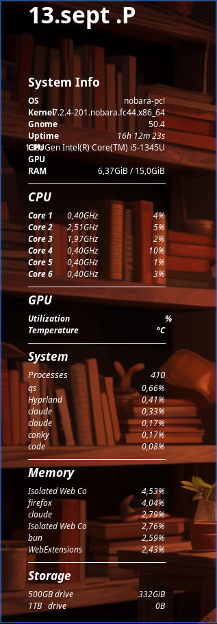

# conky-widget

My Conky system-monitor widget from 2021, originally shared on
[Pastebin](https://pastebin.com/u8vGCLXP) on July 25, 2021.



It shows the date, system info (OS, kernel, GNOME version, uptime, CPU, GPU, RAM),
per-core CPU frequency and load, NVIDIA GPU utilization and temperature, top
processes by CPU and memory, and disk usage.

## Requirements

- Conky 1.10+ (Lua config syntax) with Lua support
- Fira Mono and Open Sans Light fonts
- NVIDIA driver with `nvidia-smi` and `nvidia-settings`
- GNOME Shell (for the version line)
- `~/.conky/conky_grey.lua`, which provides the `main` and `background` draw hooks.
  It isn't part of the original paste and isn't included here.

## Usage

```sh
conky -c conky.conf
```

The storage section expects a drive mounted at `/mnt/Home Drive`, and the CPU section
lists 6 cores. Change these to match your machine.
